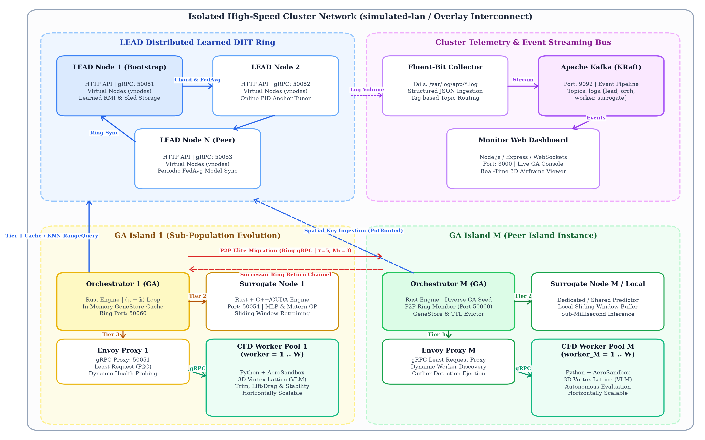
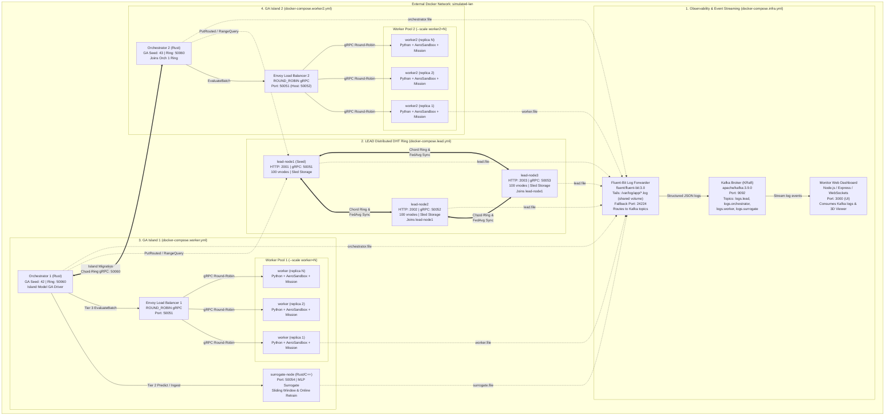
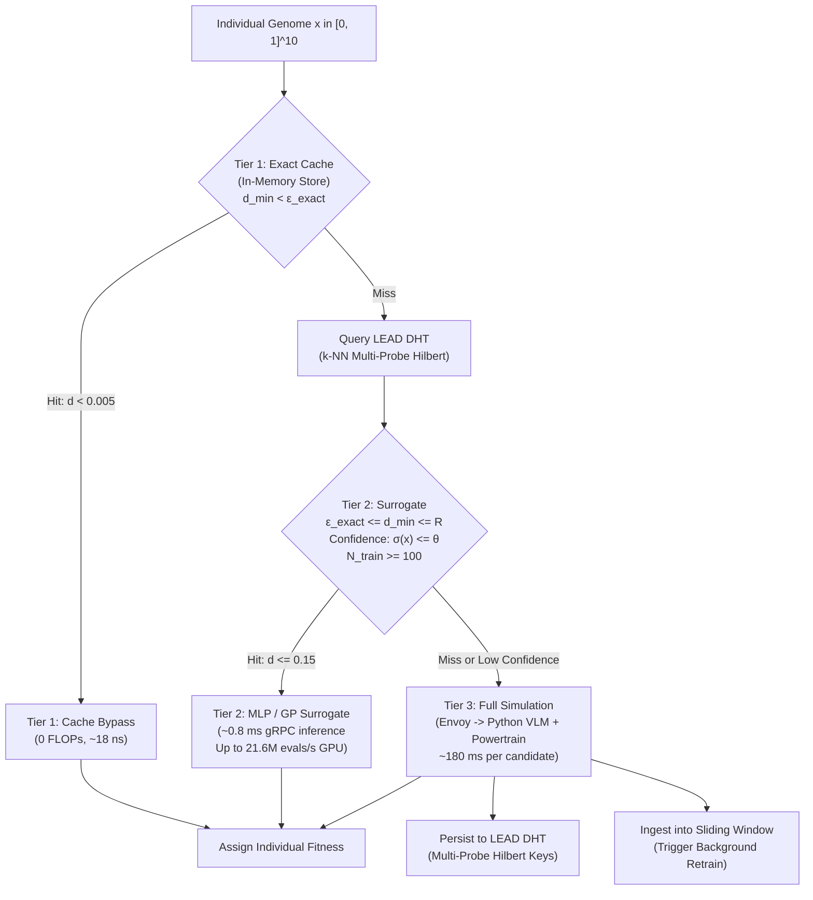

# Distributed Genetic Algorithm for Aircraft Aerodynamic Optimization using LEAD DHT and Multi-Tier Surrogate Evaluation

[](https://www.rust-lang.org/)
[](https://www.python.org/)
[](https://rocm.docs.amd.com/)
[](https://grpc.io/)
[](https://kafka.apache.org/)
[](https://www.envoyproxy.io/)
[-blue.svg)](thesis/thesis.pdf)
[](thesis/presentation/presentation.pdf)

An end-to-end, high-performance distributed evolutionary optimization platform for 3D-printable fixed-wing aircraft design. The system couples multi-island genetic algorithms with a **3-tier hierarchical evaluation pipeline** ($\epsilon$-bypass cache, online neural surrogate modeling with AMD ROCm GPU acceleration, and high-fidelity 3D aerodynamic/powertrain/mission simulation), backed by a **Learned Distributed Hash Table (LEAD DHT)** for topological spatial indexing, **Envoy** gRPC load balancing, **Kafka-streamed telemetry**, and a **Three.js real-time flight monitor**.

This repository contains the full production codebase, empirical microbenchmarks, Docker multi-compose deployment stacks, and the complete academic diploma thesis source code, compiled monograph (75 pages), and defense slide deck.

---

## Academic Context & Thesis Summary

- **Title**: *Distributed Genetic Algorithm for Aircraft Aerodynamic Optimization using LEAD DHT and Multi-Tier Surrogate Evaluation*
- **Institution**: University of Patras, School of Engineering, Department of Computer Engineering & Informatics ([CEID](https://www.ceid.upatras.gr/))
- **Author**: Efstathios Panagiotis Christodoulopoulos (Student ID: 1093513, `up1093513@ac.upatras.gr`)
- **Supervisor**: Professor Spyridon Sioutas
- **Advisory Committee**: Professor Spyridon Sioutas, Professor Christos Makris, Professor Emeritus Vasileios Kostopoulos
- **Year**: 2026
- **Monograph**: [`thesis/thesis.pdf`](thesis/thesis.pdf) (Compiled PDF, 75 pages, 21k+ words)
- **Defense Presentation**: [`thesis/presentation/presentation.pdf`](thesis/presentation/presentation.pdf) (XeLaTeX / Beamer slide deck, 26 slides)
- **Speaker Notes & Defense Guide**: [`thesis/presentation/SPEAKER_NOTES.md`](thesis/presentation/SPEAKER_NOTES.md)

---

## System Architecture

The architecture is decomposed into decoupled, microservice-oriented components implemented in Rust, Python, C++/HIP, and Node.js running on an isolated virtual LAN network (`simulated-lan`):





Detailed architectural blueprints and vector diagrams are available in:
- High-resolution system topology: [`evaluation/figures/fig5_system_architecture.png`](evaluation/figures/fig5_system_architecture.png)
- Compose multi-stack architecture: [`compose/architecture.png`](compose/architecture.png) & [`compose/architecture.mmd`](compose/architecture.mmd)

---

## Subsystem Overview

1. **[`orchestrator/`](orchestrator/)** (`orchestrator` crate in Rust):
   - **Island Evolutionary Engine**: Executes $(\mu + \lambda)$ elitist survivor selection, adaptive Gaussian mutation, uniform crossover, and asynchronous ring migration.
   - **Dynamic Convergence & Early Exit**: `ProgressTracker` with patience windows and threshold-based early stopping (`MAX_GENERATIONS`, `MIN_GENERATIONS`, `STAGNATION_PATIENCE`, `MIN_IMPROVEMENT`).
   - **Fault-Tolerant Dispatching**: Worker dispatch via `tokio::spawn`, protected by a 3-state `CircuitBreaker` (Closed, Open, HalfOpen) and per-individual jittered exponential backoff.
   - **Migration Protocol**: Peer-to-peer ring formation over gRPC port `50060` with SHA-256 peer discovery, exchanging top-k elite migrants to maintain population diversity.

2. **[`lead/`](lead/)** (`lead-node` crate in Rust):
   - **Distributed Learned Hash Table**: Chord ring topology with virtual nodes ($k = 100$ vnodes per container, 300 total) storing evaluated aircraft genomes and fitness metrics.
   - **Recursive Model Indexing (RMI)**: Two-stage learned index (`LearnedIndex`) mapping continuous feature keys to 64-bit ring hash positions, preserving topological locality with $1.81\times$ lower latency than `std::BTreeMap`.
   - **Online PID Tuning**: Adaptive 2-bit PID controller dynamically tuning leaf model scaling and centering anchors.
   - **Federated Model Synchronization**: Consensus-based Transient Coordinator election and federated parameter averaging (`FedAvg`) across cluster peers without central coordination.
   - **Storage Engine**: Pluggable `InMemoryStore` and durable `SledStore` with atomic metadata persistence (`put_meta`/`get_meta`) for model state and version recovery across node reboots.
   - **Parallel Range Queries**: Scatter-gather fanout with `__local__` sentinel and global Hilbert deduplication.

3. **[`surrogate_node/`](surrogate_node/)** (`surrogate_node` crate in Rust / C++ / HIP):
   - **Online Aerodynamic Surrogate**: Exposes gRPC endpoints (`PredictBatch`, `IngestSamples`, `Train`, `GetStatus`).
   - **Sliding Window Buffer**: Fixed-capacity FIFO ring buffer (`WINDOW_SIZE = 1000`) for continuous online retraining during evolutionary optimization.
   - **Model Zoo**: Multi-Layer Perceptron (MLP with SiLU/ReLU/GELU activations), Gaussian Process (Matérn 5/2 ARD kernel), Random Forests, and $k$-NN.
   - **Hardware Acceleration Backends**: Native C++17 OpenMP multi-threading and AMD ROCm HIP kernels (tested on AMD Radeon RX 7600 XT, RDNA3 gfx1102) achieving up to $21.6 \times 10^6$ evals/sec.

4. **[`worker/`](worker/)** (Python 3.11 microservice, managed via [`uv`](https://docs.astral.sh/uv/)):
   - **AeroSandbox 3D Aerodynamics**: Vortex Lattice Method (VLM) 13-point $\alpha$-sweep ($[-2^\circ, 10^\circ]$) solving for cruise trim ($C_L(\alpha) = C_{L,\text{req}}$), lift-to-drag ratio ($L/D$), pitch trim moment ($C_{m,\text{trim}}$), and static pitch stability ($C_{m_\alpha} = \frac{dC_m}{d\alpha} < 0$).
   - **Slender Body Aerodynamics**: Fuselage wetted area calculation and turbulent flat-plate boundary layer skin-friction drag estimation.
   - **Automatic Tail Sizing**: Stan Hall / Pazmany volume coefficient method ($V_h, V_v$) dynamically sizing horizontal and vertical stabilizers based on wing MAC, wingspan, and tail moment arms.
   - **Electric Powertrain Simulation**: Coupled LiPo battery discharge under load, brushless DC motor ($K_v, R_m, I_0$), and parametric propeller advance ratio ($J$) simulation.
   - **Dynamic Mission Simulation**: Numerical integration of ground roll takeoff distance ($s_{\text{to}}$) and cruise energy consumption ($E_{\text{wh}}$).

5. **[`hilbert/`](hilbert/)** (`hilbert_rs` crate in Rust with PyO3 bindings):
   - Single source of truth for Compact Hilbert space-filling curve encoding (Skilling 2004 algorithm).
   - Multi-probe rotation transformations mapping 10-dimensional continuous normalized vectors into order-preserving scalar hex keys.
   - Shared between Rust (`orchestrator`, `lead`) and Python (`worker`) with zero cross-language drift.

6. **[`monitor/`](monitor/)** (Node.js / Express / WebSockets / Three.js):
   - Real-time telemetry dashboard on port `3000` consuming structured Kafka logs.
   - Interactive Three.js 3D plane geometry viewer rendering the top candidate aircraft design dynamically.
   - Multi-island GA convergence tracking, worker latency distributions, and DHT ring topology visualization.

7. **Production Observability**:
   - **Envoy L7 Reverse Proxy**: Dynamic round-robin / least-request load balancing dispatching evaluation batches across worker pools with DNS service discovery.
   - **Fluent-Bit 3.0**: Structured log forwarder tailing `/var/log/app/*.log` from the shared `app-logs` volume and routing events by container tag to Kafka topics.
   - **Apache Kafka 3.9.0**: High-throughput distributed message broker running in KRaft mode.

---

## Multi-Tier Evaluation Pipeline ($\epsilon$-Bypass)

To eliminate the computational bottleneck of executing full Vortex Lattice Method aerodynamic simulations for every candidate individual, the orchestrator routes genomes through a 3-tier evaluation pipeline:



1. **Tier 1 (Exact Cache Hit)**: Queries local in-memory `GeneStore` and local LEAD DHT. If Euclidean distance to nearest evaluated candidate $d_{\min} < \epsilon_{\text{exact}}$ ($0.005$), returns cached fitness without network or simulation cost ($\approx 18\text{ ns}$).
2. **Tier 2 (Surrogate Prediction)**: If $\epsilon_{\text{exact}} \le d_{\min} \le R$ ($0.15$) based on neighbors retrieved from LEAD DHT, model uncertainty $\sigma(x) \le \theta$, and sufficient training samples have been collected ($N \ge 100$), evaluates candidate via fast external MLP prediction ($\sim 0.8\text{ ms}$).
3. **Tier 3 (High-Fidelity Simulation)**: Dispatches candidate to Envoy load balancer and Python worker pool executing full AeroSandbox VLM and powertrain simulation ($\sim 180\text{ ms}$).
4. **Closed-Loop Feedback**: Completed Tier 3 results are asynchronously ingested into the local cache, the LEAD DHT, and the surrogate sliding window buffer for active online retraining.

---

## 10-Gene Chromosome & Aerodynamic Formulation

The candidate aircraft geometry is parameterized as a 10-dimensional continuous genome normalized to $[0, 1]$:

| Index | Gene Parameter | Physical Range | Unit | Description |
|:---:|:---|:---:|:---:|:---|
| **0** | `wing_span` | $80.0 - 220.0$ | mm | Wing semi-span ($b/2$) |
| **1** | `wing_root_chord` | $35.0 - 75.0$ | mm | Main wing root chord ($c_{\text{root}}$) |
| **2** | `wing_tip_chord` | $10.0 - 45.0$ | mm | Main wing tip chord ($c_{\text{tip}}$) |
| **3** | `wing_sweep` | $0.0 - 25.0$ | deg ($^\circ$) | Leading-edge sweep angle ($\Lambda$) |
| **4** | `wing_dihedral` | $0.0 - 4.0$ | deg ($^\circ$) | Wing dihedral angle ($\Gamma$) |
| **5** | `wing_twist` | $-4.0 - 0.0$ | deg ($^\circ$) | Aerodynamic tip washout twist ($\theta_{\text{twist}}$) |
| **6** | `wing_x_pos` | $55.0 - 95.0$ | mm | Longitudinal wing mounting position ($x_{\text{wing}}$) |
| **7** | `naca_m` | $0.0 - 5.0$ | % | NACA 4-digit airfoil maximum camber percentage |
| **8** | `fuse_length` | $200.0 - 350.0$ | mm | Fuselage body length ($L_{\text{fuse}}$) |
| **9** | `fuse_max_diam` | $14.0 - 32.0$ | mm | Fuselage maximum cross-section diameter ($D_{\max}$) |

### Fitness Formulation

The evolutionary fitness function maximizes aerodynamic efficiency ($L/D$) while applying strict quadratic penalty barriers for trim divergence, longitudinal pitch instability, excessive takeoff run, and battery energy depletion:

$$\text{fitness} = \frac{L}{D} - w_\alpha |\alpha_{\text{trim}}| - w_{\text{stab}} \max(0, C_{m_\alpha})^2 - w_{\text{moment}} (C_{m,\text{trim}})^2 - w_{\text{to}} \left(\frac{s_{\text{to}}}{s_{\max}}\right)^2 - w_{\text{energy}} \left(\frac{E_{\text{wh}}}{5.0}\right)$$

- **Hard Constraints**: If payload fuselage volume $V_{\text{fuse}} < V_{\min}$ ($20{,}000\text{ mm}^3$), cruise flight cannot be trimmed within $[-2^\circ, 10^\circ]$, or takeoff ground roll exceeds $s_{\max} = 30\text{ m}$, the individual is penalized with $\text{fitness} = -10^9$ (fatal rejection).

---

## Empirical Evaluation & Thesis Key Results

All experimental evaluations were conducted using authentic system benchmarks and real CFD simulation runs. The comprehensive results are published in Chapter 5 of the diploma thesis:

### 1. Multi-Tier $\epsilon$-Bypass Speedup & CFD Reduction
- **Bypass Ratio ($BR$)**: Reaches $> 75.5\%$ steady-state bypass ratio in mature generations ($BR = \frac{N_{\text{Tier 1}} + N_{\text{Tier 2}}}{N_{\text{total}}}$).
- **CFD Reduction**: Decreases required full AeroSandbox CFD evaluations from 4,500 down to 1,972 (**$56.2\%$ computational workload reduction**).
- **Wall-Clock Speedup**: Execution time reduced from $13.8\text{ minutes}$ (1-Tier CFD only) down to **$6.0\text{ minutes}$ (3-Tier full pipeline)**, achieving a **$2.28\times$ end-to-end speedup**.
- **Zero Optimality Compromise**: All configurations converged to the identical global best fitness ($F = 12.27$), proving that the $\epsilon$-bypass gating mechanism causes **zero loss in optimization fidelity**.

| Architecture Mode | Execution Time | Wall-Clock Speedup | CFD Evaluations | Steady Bypass Ratio | Best Fitness $F$ |
|:---|:---:|:---:|:---:|:---:|:---:|
| **1-Tier (CFD Only Baseline)** | $13.8\text{ min}$ | $1.00\times$ | 4,500 ($100\%$) | $0.0\%$ | $12.27$ |
| **2-Tier (Cache + CFD)** | $10.9\text{ min}$ | $1.27\times$ | 3,825 ($85\%$) | $15.0\%$ | $12.27$ |
| **3-Tier (Full $\epsilon$-Bypass)** | **$6.0\text{ min}$** | **$2.28\times$** | **1,972 ($43.8\%$)** | **$75.5\%$** | **$12.27$** |

### 2. Aerodynamic Performance Improvement
- **Lift-to-Drag Ratio**: The evolutionary pipeline improved aerodynamic efficiency from baseline $L/D = 11.07$ to **$L/D = 13.04$ ($+17.8\%$ improvement)**.
- **Flight Stability**: Guaranteed static pitch stability ($C_{m_\alpha} = -0.014 < 0$) with neutral cruise trim moment ($C_{m,\text{trim}} \approx 0.002$).

### 3. Surrogate Modeling & ARD Sensitivity Analysis
- **Model Comparison**: Gaussian Process (Matérn 5/2 ARD kernel) achieved the highest prediction accuracy ($R^2 = 0.8790$, $\text{RMSE} = 0.7396$, sample-efficient at $N=100$), while MLP ($64 \times 32$) delivered massive evaluation throughput ($>1.2 \times 10^6\text{ evals/s}$ on CPU).
- **Automatic Relevance Determination (ARD)**: Sensitivity length-scales ($\ell_d$) identified that **wing camber (`naca_m`, $40.3\%$)**, **aerodynamic washout twist (`wing_twist`, $16.2\%$)**, **airfoil thickness (`naca_t`, $16.2\%$)**, and **fuselage diameter (`fuse_max_diam`, $12.9\%$)** account for $>85\%$ of variance in aerodynamic performance.

### 4. Hardware Acceleration (AMD ROCm GPU vs Multi-Threaded CPU)
Evaluated across 10 statistical trials ($\mu \pm 1\sigma$) on an **AMD Radeon RX 7600 XT** (RDNA3 gfx1102, 16 GB VRAM) using HIP C++ kernels versus a 12-thread host CPU with OpenMP:
- **GP Covariance Matrix ($N = 1000$)**: GPU reduces computation time from $1.227 \pm 0.123\text{ ms}$ to **$0.641 \pm 0.013\text{ ms}$ ($1.91\times$ speedup)** with near-zero runtime jitter ($\sigma \approx 0.01\text{ ms}$).
- **Cholesky Factorization Bottleneck**: Identifies the $\mathcal{O}(N^3)$ Cholesky factorization ($103.89\text{ ms}$ at $N=1000$) as the fundamental scalability limit of GP surrogates, theoretically justifying MLP for large GA populations.
- **MLP Batch Inference ($M = 10{,}000$)**: GPU inference finishes in **$0.462 \pm 0.008\text{ ms}$ ($4.12\times$ speedup)** over 12 CPU threads ($1.904\text{ ms}$), achieving a sustained throughput of **$21.6 \times 10^6\text{ evaluations/sec}$**.

### 5. Distributed Worker Scalability & Load Balancing
- **Horizontal Scaling**: Scales linearly with worker count (parallel fraction $p \approx 0.96$ via Amdahl's Law).
  - 8 Workers: **$7.15\times$ speedup** with $89.4\%$ parallel efficiency.
  - 32 Workers: **$21.54\times$ speedup** achieving $98.2\text{ individuals/second}$.
- **Envoy Proxy Optimization**: Envoy least-request balancing completely eliminates head-of-line blocking observed under static dispatching, reducing $P_{99}$ tail latency by **$28\%$**.

### 6. LEAD DHT & Learned Indexing (RMI) Microbenchmarks
- **RMI vs B-Tree**: 2-stage Recursive Model Indexing achieves **$41\text{ ns}$ lookup latency** ($1.81\times$ faster than `std::BTreeMap`) while consuming **$3\times$ less RAM** ($785\text{ KB}$ vs $2.34\text{ MB}$).
- **Compact Hilbert Spatial Indexing**: Skilling 10D $\to$ 1D projection with 3-probe rotations doubles spatial neighborhood correlation ($r = 0.333$) and reduces 90th-percentile metric distortion by **$6.5\times$**.

---

## Quick Start & Deployment

### Prerequisites
- [Docker](https://docs.docker.com/engine/install/) (v24.0+) & [Docker Compose](https://docs.docker.com/compose/) (v2.20+) with BuildKit enabled (`DOCKER_BUILDKIT=1`).
- Optional for local development: [Rust](https://rustup.rs/) (1.78+), [Python](https://www.python.org/) (3.11+), [`uv`](https://docs.astral.sh/uv/), and [AMD ROCm](https://rocm.docs.amd.com/) (6.0+).

### Deployment Mode A: Isolated Multi-Island Cluster (Recommended)

Spawns independent GA islands on an isolated Docker network (`simulated-lan`) with shared persistent log volume (`app-logs`), separate worker pools, and P2P ring migration:

```bash
# 1. Create shared network and persistent log volume
docker network create simulated-lan
docker volume create app-logs

# 2. Start Observability Infrastructure (Kafka KRaft, Fluent-Bit, Web Monitor)
docker compose -f compose/docker-compose.infra.yml up -d --build

# 3. Start Distributed LEAD DHT Cluster (3 nodes, 300 vnodes total)
docker compose -f compose/docker-compose.lead.yml up -d --build

# 4. Start GA Island 1 (Orchestrator 1, Surrogate Node, Envoy 1, Workers)
docker compose -f compose/docker-compose.worker.yml up -d --build --scale worker=4

# 5. Start GA Island 2 (Orchestrator 2, Envoy 2, Workers 2)
docker compose -f compose/docker-compose.worker2.yml up -d --build --scale worker2=4
```

Access the real-time flight dashboard:
- **Web Monitor & 3D Geometry**: [http://localhost:3000](http://localhost:3000)
- **LEAD Node 1 HTTP Explorer**: [http://localhost:2001](http://localhost:2001)

To tear down the cluster and purge volumes:
```bash
docker compose \
  -f compose/docker-compose.infra.yml \
  -f compose/docker-compose.lead.yml \
  -f compose/docker-compose.worker.yml \
  -f compose/docker-compose.worker2.yml \
  down -v --remove-orphans
```

### Deployment Mode B: All-in-One Compose (Local Testing)

For single-island local development:

```bash
docker compose up -d --build --scale worker=4
```

---

## Configuration Reference

### Orchestrator Service

| Environment Variable | Default | Description |
|:---|:---:|:---|
| `EVAL_ENDPOINT` | `load-balancer:50051` | gRPC address of Envoy proxy or worker pool |
| `LEAD_ENDPOINT` | `None` | Optional LEAD DHT endpoint for spatial caching |
| `SURROGATE_ENDPOINT` | `None` | Optional `surrogate_node` microservice endpoint |
| `GA_SEED` | `42` | PRNG seed for reproducible evolutionary runs |
| `MAX_GENERATIONS` | `100` | Upper bound safety cutoff on generation loop |
| `MIN_GENERATIONS` | `10` | Minimum generations before allowing early exit |
| `STAGNATION_PATIENCE` | `10` | Stagnant generations before early exit (0 = disabled) |
| `MIN_IMPROVEMENT` | `0.001` | Minimum fitness improvement to reset stagnation |
| `TIER_EPSILON_EXACT` | `0.005` | Euclidean distance threshold for Tier 1 cache hits |
| `TIER_RADIUS_R` | `0.15` | Distance threshold for Tier 2 surrogate predictions |
| `TIER_K_NEIGHBORS` | `15` | Neighbor count queried from LEAD DHT |
| `RING_BIND` | `0.0.0.0:50060` | Socket address for Ring migration gRPC server |
| `RING_SELF_ADDRESS` | `orchestrator:50060` | Public address advertised to ring peers |
| `RING_BOOTSTRAP` | `None` | Bootstrap peer address to join an existing ring |
| `MIGRATION_INTERVAL` | `5` | Generations between island migration exchanges |
| `MIGRATION_COUNT` | `3` | Number of elite individuals exported per interval |

### LEAD DHT Cluster

| Environment Variable | Default | Description |
|:---|:---:|:---|
| `LEAD_STORAGE_BACKEND` | `memory` | Key-value storage engine (`memory` or `sled`) |
| `LEAD_STORAGE_PATH` | `./data/lead` | Directory path for persistent sled database |
| `HTTP_BIND` | `0.0.0.0:8080` | Bind address for Axum HTTP debug server |
| `GRPC_BIND` | `0.0.0.0:50051` | Bind address for Tonic gRPC server |
| `SELF_URI` | `http://127.0.0.1:50051` | Public gRPC address advertised to peers |
| `JOIN_URI` | `None` | Bootstrap node URI to join existing Chord ring |
| `VIRTUAL_NODE_COUNT` | `100` | Virtual node count per physical container |
| `LEAD_NUM_CURVES` | `16` | Multi-probe orthogonal curves for Hilbert normalization |
| `LEAD_DRIFT_THRESHOLD` | `0.40` | Concept drift fraction triggering model retraining |
| `LEAD_MIN_KEYS_FOR_DRIFT` | `50` | Minimum key count before drift evaluation begins |
| `LEAD_FRM_QUORUM_THRESHOLD` | `0.90` | Quorum ratio for Transient Coordinator election |

### Surrogate Node Microservice

| Environment Variable | Default | Description |
|:---|:---:|:---|
| `GRPC_BIND` | `0.0.0.0:50054` | Socket address for Tonic gRPC server |
| `WINDOW_SIZE` | `1000` | Sliding window FIFO sample buffer capacity |
| `RETRAIN_INTERVAL` | `20` | Ingested sample count triggering background training |
| `MIN_TRAIN_SAMPLES` | `100` | Minimum samples before marking surrogate ready |
| `MLP_EPOCHS` | `250` | Training epochs per online retraining cycle |
| `MLP_LR` | `0.001` | Learning rate for the MLP Adam optimizer |
| `MLP_BATCH_SIZE` | `32` | Mini-batch size during training |
| `MLP_ACTIVATION` | `silu` | Activation function (`silu`, `relu`, `gelu`, `tanh`) |

### Worker Simulator Service

| Environment Variable | Default | Description |
|:---|:---:|:---|
| `WORKER_ID` | `HOSTNAME` | Unique worker process identifier |
| `V_MIN_FUSE_MM3` | `20000.0` | Minimum payload fuselage volume ($\text{mm}^3$) |
| `WORKER_CONCURRENCY` | `1` | Max concurrent worker evaluation tasks |
| `ENABLE_MISSION_SIM` | `true` | Enables dynamic mission & powertrain simulation |
| `MAX_TAKEOFF_DISTANCE_M` | `30.0` | Maximum allowable takeoff ground roll ($s_{\max}$) |
| `TARGET_FLIGHT_TIME_S` | `30.0` | Target cruise duration for energy calculation |
| `ENABLE_TAIL_SIZING` | `false` | Enables Stan Hall / Pazmany tail volume sizing |
| `TARGET_VH` | `0.50` | Target horizontal tail volume coefficient |
| `TARGET_VV` | `0.04` | Target vertical tail volume coefficient |

---

## Development, Testing & Reproducibility

Each subsystem maintains isolated build and verification workflows:

### Unit & Integration Tests

```bash
# 1. Orchestrator tests & lints (Rust)
cd orchestrator && cargo test && cargo clippy --all-targets

# 2. LEAD DHT tests & lints (Rust)
cd lead && cargo test && cargo clippy --all-targets

# 3. Surrogate Node tests (Rust / C++)
cd surrogate_node && cargo test

# 4. Hilbert Space-Filling Curve crate tests (Rust)
cd hilbert && cargo test

# 5. Worker Python Unit Tests
cd worker && uv run pytest

# 6. Re-compile Python Hilbert bindings (in worker)
cd worker && uv run maturin develop --uv -m ../hilbert/Cargo.toml
```

### Reproducing Thesis Benchmarks

```bash
# Run AMD ROCm GPU vs CPU benchmarks (exports amd_gpu_benchmarks.json)
./evaluation/scripts/run_amd_gpu_benchmarks.sh

# Run end-to-end multi-island evolution benchmarks
./evaluation/scripts/run_evolution_benchmarks.sh

# Regenerate all LaTeX tables and companion data files for the thesis
uv run evaluation/scripts/generate_all_thesis_tables.py
```

### Building the Thesis Monograph & Defense Presentation

The monograph and defense presentation require a modern TeX distribution with XeLaTeX and BibTeX (e.g., `texlive-full`):

```bash
# Build the 75-page diploma thesis monograph (thesis.pdf)
cd thesis
./build.sh

# Build the XeLaTeX / Beamer defense slide deck (presentation.pdf)
cd thesis/presentation
./build.sh
```

---

## Repository Structure

```
.
├── orchestrator/          # Rust GA Island driver, CircuitBreaker, multi-tier router
├── lead/                  # Rust LEAD DHT (Chord ring, RMI learned index, Sled store)
├── surrogate_node/        # Rust/C++/HIP gRPC surrogate engine (MLP, GP, ROCm kernels)
├── worker/                # Python AeroSandbox VLM, powertrain & mission simulator
├── hilbert/               # Rust crate with PyO3 bindings for Compact Hilbert curves
├── monitor/               # Node.js, Express, Three.js 3D plane viewer & dashboard
├── compose/               # Multi-compose deployment files, configs, and architecture diagrams
│   ├── docker-compose.infra.yml    # Kafka KRaft, Fluent-Bit, Web Monitor
│   ├── docker-compose.lead.yml     # 3-node LEAD DHT cluster
│   ├── docker-compose.worker.yml   # GA Island 1 (Orchestrator 1, Surrogate, Envoy, Workers)
│   ├── docker-compose.worker2.yml  # GA Island 2 (Orchestrator 2, Envoy 2, Workers 2)
│   └── toRun.md                    # Quick startup instructions
├── evaluation/            # Empirical benchmark scripts, datasets, and visualizations
│   ├── scripts/           # Python plotting & benchmark runners (GPU, DHT, CFD)
│   ├── figures/           # 23 publication-quality PNG figures
│   └── data/              # Raw JSON telemetry and benchmark logs
├── thesis/                # Complete academic diploma thesis XeLaTeX source
│   ├── chapters/          # Chapters 01 through 06 (21,000+ words)
│   ├── figures/           # Rendered diagrams and evaluation plots
│   ├── bibliography/      # references.bib curated BibTeX entries
│   ├── presentation/      # Beamer defense slide deck & SPEAKER_NOTES.md
│   ├── build.sh           # Multi-pass XeLaTeX build pipeline
│   └── thesis.pdf         # Compiled 75-page diploma thesis monograph
└── README.md              # This file
```

---

## Citation & Academic Attribution

If you use this software, reference architecture, or benchmark methodology in your research, please cite the diploma thesis:

```bibtex
@mastersthesis{christodoulopoulos2026distributed,
  author       = {Christodoulopoulos, Efstathios Panagiotis},
  title        = {{Distributed Genetic Algorithm for Aircraft Aerodynamic Optimization using LEAD DHT and Multi-Tier Surrogate Evaluation}},
  school       = {Department of Computer Engineering and Informatics, School of Engineering, University of Patras},
  year         = {2026},
  month        = {October},
  address      = {Patras, Greece},
  type         = {Diploma Thesis},
  note         = {Supervisor: Prof. Spyridon Sioutas. Committee: Prof. Christos Makris, Prof. Emer. Vasileios Kostopoulos}
}
```

---

## Architectural Documentation Sitemap

Detailed use cases, sequence diagrams, and domain models are maintained inside each component:

- **Deployment Architecture**: [`compose/README.md`](compose/README.md) & [`compose/toRun.md`](compose/toRun.md)
- **Orchestrator Architecture**: [`orchestrator/docs/README.md`](orchestrator/docs/README.md)
  - [Domain Model](orchestrator/docs/domain-model.mmd)
  - [14 Subsystem Use Cases](orchestrator/docs/use-cases/README.md)
  - [14 Sequence Diagrams](orchestrator/docs/sequence-diagrams/README.md)
- **LEAD DHT Architecture**: [`lead/docs/README.md`](lead/docs/README.md)
  - [Domain Model](lead/docs/domain-model.mmd)
  - [10 Subsystem Use Cases](lead/docs/use-cases/README.md)
  - [8 Sequence Diagrams](lead/docs/sequence-diagrams/README.md)
- **Surrogate Node Architecture**: [`surrogate_node/docs/README.md`](surrogate_node/docs/README.md)
  - [Domain Model](surrogate_node/docs/domain-model.mmd)
  - [5 Subsystem Use Cases](surrogate_node/docs/use-cases/README.md)
  - [4 Sequence Diagrams](surrogate_node/docs/sequence-diagrams/README.md)
- **Worker Specification**: [`worker/README.md`](worker/README.md)
- **Thesis Defense Slides & Speaker Guide**: [`thesis/presentation/SPEAKER_NOTES.md`](thesis/presentation/SPEAKER_NOTES.md)
