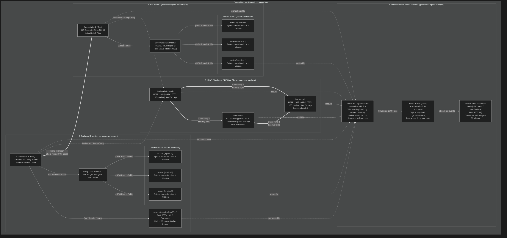

# Distributed Genetic Algorithm for 3D-Printable Aircraft Design

An end-to-end, high-performance distributed evolutionary optimization system for 3D-printable fixed-wing aircraft designs. The system couples multi-island genetic algorithms with a 3-tier hierarchical evaluation pipeline ($\epsilon$-bypass cache, online neural surrogate modeling, and high-fidelity aerodynamic/powertrain/mission simulation), backed by a Learned Distributed Hash Table (LEAD) for topological spatial indexing, Envoy load balancing, Kafka-streamed telemetry, and real-time 3D flight monitoring.



---

## Architecture Overview

The system is engineered as decoupled, microservice-oriented components built with Rust, Python, C++, and Node.js:

```
                                  +-------------------------------------------------------------+
                                  |                     Web Monitor Dashboard                   |
                                  |              (Node.js / Express / WebSockets / Three.js)    |
                                  +------------------------------^------------------------------+
                                                                 | WebSocket Streams
                                  +------------------------------+------------------------------+
                                  |                  Apache Kafka (KRaft Broker)                |
                                  |        Topics: logs.lead, logs.orchestrator, logs.worker,   |
                                  |                         logs.surrogate                      |
                                  +------------------------------^------------------------------+
                                                                 | Tail JSON / Log Forwarding
                                  +------------------------------+------------------------------+
                                  |              Fluent-Bit 3.0 (Shared Log Volume)             |
                                  +------------------------------^------------------------------+
                                                                 |
            +----------------------------------------------------+----------------------------------------------------+
            |                                                    |                                                    |
+-----------+------------+                           +-----------+------------+                           +-----------+------------+
|        LEAD DHT        |                           |       Orchestrator     |                           |       Surrogate Node   |
|  Chord Ring + RMI      | <=======================> |  Island GA Driver      | <-----------------------> |  Online MLP Surrogate  |
|  Learned Indexing      |     PutRouted / Range     |  Multi-Tier Pipeline   |      Predict / Ingest     |  C++/CUDA/OpenMP       |
|  (Rust `lead-node`)    |                           |  (Rust `orchestrator`) |                           |  (Rust/C++ microserv.) |
+------------------------+                           +-----------+------------+                           +------------------------+
                                                                 |
                                                                 | EvaluateBatch (gRPC)
                                                                 v
                                                     +-----------+------------+
                                                     |    Envoy Load Balancer |
                                                     |    Round-Robin Proxy   |
                                                     +-----------+------------+
                                                                 |
                                           +---------------------+---------------------+
                                           |                     |                     |
                                           v                     v                     v
                                    +--------------+      +--------------+      +--------------+
                                    | Worker 1     |      | Worker 2     |      | Worker N     |
                                    | Python VLM   |      | Python VLM   |      | Python VLM   |
                                    | + Powertrain |      | + Powertrain |      | + Powertrain |
                                    | + Mission    |      | + Mission    |      | + Mission    |
                                    +--------------+      +--------------+      +--------------+
```

### Components

1. **[`orchestrator/`](orchestrator/)** (`orchestrator` crate in Rust):
   - GA evolutionary loop with Gaussian mutation, $(\mu + \lambda)$ elitist survivor selection, and island model migration across a Chord-like ring.
   - **Dynamic Convergence**: `ProgressTracker` with patience window and threshold-based early stopping (`MAX_GENERATIONS`, `MIN_GENERATIONS`, `STAGNATION_PATIENCE`, `MIN_IMPROVEMENT`).
   - **Resilient Evaluation**: Batch evaluation chunking via `tokio::spawn`, guarded by a 3-state `CircuitBreaker` (Closed, Open, HalfOpen) and per-individual retries with exponential backoff and jitter.
   - **Multi-Tier Evaluator**: Hierarchical pipeline reducing simulation workload via 0-FLOP cache hits and external surrogate predictions.

2. **[`lead/`](lead/)** (`lead-node` crate in Rust):
   - Chord-like Distributed Hash Table (LEAD) with virtual nodes ($k = 100$ vnodes per container).
   - **Recursive Model Indexing (RMI)**: Two-stage learned index (`LearnedIndex`) mapping continuous feature keys to 64-bit ring hash positions, preserving topological locality.
   - **Online PID Tuning**: 2-bit PID controller dynamically tuning leaf model scaling and centering anchors.
   - **Federated Averaging (`FedAvg`)**: Consensus-based Transient Coordinator election and federated model retraining across cluster peers.
   - **Pluggable Storage**: In-memory `InMemoryStore` and durable `SledStore` with internal metadata persistence (`put_meta`/`get_meta`) for model version recovery across node restarts.
   - **Parallel Range Queries**: Scatter-gather fanout with `__local__` sentinel and global Hilbert deduplication.

3. **[`surrogate_node/`](surrogate_node/)** (`surrogate_node` crate in Rust/C++):
   - Aerodynamic surrogate modeling microservice exposing gRPC endpoints (`PredictBatch`, `IngestSamples`, `Train`, `GetStatus`).
   - Sliding window buffer (`WINDOW_SIZE = 1000`) for active sample ingestion.
   - Multi-Layer Perceptron (MLP) with SiLU/ReLU activations, Adam optimization, and zero-downtime atomic model swapping.
   - Native compute acceleration backends (C++17, OpenMP multi-threading, and CUDA).

4. **[`worker/`](worker/)** (Python gRPC evaluation microservice):
   - **AeroSandbox 3D Aerodynamics**: Vortex Lattice Method (VLM) 13-point $\alpha$-sweep ($[-2^\circ, 10^\circ]$) solving for cruise trim ($C_L(\alpha) = C_{L,\text{req}}$), lift-to-drag ratio ($L/D$), pitch trim moment ($C_{m,\text{trim}}$), and static pitch stability ($C_{m_\alpha} = \frac{dC_m}{d\alpha} < 0$).
   - **Fuselage Aerodynamics**: Slender body wetted area calculations and turbulent flat-plate boundary layer skin-friction drag estimation.
   - **Tail Volume Sizing**: Stan Hall / Pazmany volume coefficient method ($V_h, V_v$) sizing horizontal and vertical stabilizers based on wing MAC, wingspan, and tail moment arms.
   - **Electric Powertrain Modeling**: Coupled LiPo battery under load, brushless DC motor ($K_v, R_m, I_0$), and parametric propeller advance ratio ($J$) simulation.
   - **Dynamic Mission Simulation**: Numerical integration of ground roll takeoff distance ($s_{\text{to}}$) and cruise energy consumption ($E_{\text{wh}}$).

5. **[`hilbert/`](hilbert/)** (`hilbert_rs` crate in Rust with PyO3 bindings):
   - Single source of truth for Compact Hilbert space-filling curve encoding (Skilling 2004 algorithm).
   - Multi-probe rotation transformations mapping 10-dimensional continuous normalized vectors into order-preserving scalar hex keys.
   - Shared between Rust (`orchestrator`, `lead`) and Python (`worker`) with zero cross-language drift.

6. **[`monitor/`](monitor/)** (Node.js / Express / WebSockets / Three.js):
   - Real-time telemetry dashboard on port `3000` consuming structured Kafka logs.
   - Interactive Three.js 3D plane geometry viewer rendering the top candidate aircraft design dynamically.
   - Multi-island GA convergence tracking, worker latency distributions, and DHT ring topology visualization.

7. **Infrastructure**:
   - **Envoy**: gRPC reverse proxy load balancing evaluation requests across worker pools with round-robin dispatching and dynamic DNS resolution.
   - **Fluent-Bit**: Structured log forwarding tailing `/var/log/app/*.log` from the shared `app-logs` volume and routing by container tag to Kafka topics.
   - **Kafka**: Apache Kafka 3.9.0 in KRaft mode handling high-throughput log ingestion.

---

## Multi-Tier Evaluation Pipeline ($\epsilon$-Bypass)

To minimize expensive Vortex Lattice Method aerodynamic evaluations, the orchestrator routes candidate individuals through a 3-tier evaluation pipeline:

```mermaid
flowchart TD
    Candidate["Individual Genome [0, 1]^10"] --> ExactCheck{"Tier 1: Exact Cache\n(In-Memory Store)\nd_min < ε_exact"}
    ExactCheck -->|Hit (d < 0.005)| T1["Tier 1: Cache Bypass\n(0 FLOPs, instant)"]
    ExactCheck -->|Miss| LeadQuery["Query LEAD DHT\n(k-NN Multi-Probe Hilbert)"]
    
    LeadQuery --> SurrCheck{"Tier 2: Surrogate\nε_exact <= d_min <= R\n(Surrogate Ready?)"}
    SurrCheck -->|Hit (d <= 0.15)| T2["Tier 2: MLP Surrogate\n(~1-2 ms gRPC inference)"]
    SurrCheck -->|Miss or Low Confidence| T3["Tier 3: Worker Simulation\n(Envoy -> Python VLM + Powertrain)"]
    
    T3 --> FeedbackLead["Persist to LEAD DHT\n(Multi-Probe Hilbert Keys)"]
    T3 --> FeedbackSurr["Ingest into Sliding Window\n(Trigger Background Retrain)"]
    
    T1 --> Metric["Evaluate Fitness"]
    T2 --> Metric
    T3 --> Metric
```

1. **Tier 1 (Exact Cache Hit)**: Queries local in-memory `GeneStore`. If Euclidean distance $d_{\min} < \epsilon_{\text{exact}}$ ($0.005$), returns cached fitness without network or simulation cost.
2. **Tier 2 (MLP Surrogate Prediction)**: If $\epsilon_{\text{exact}} \le d_{\min} \le R$ ($0.15$) based on neighbors retrieved from LEAD DHT, and the surrogate model has ingested sufficient training samples ($N \ge 100$), evaluates candidate via fast external MLP prediction.
3. **Tier 3 (High-Fidelity Simulation)**: Dispatches candidate to Envoy load balancer and Python worker pool. Upon completion, the result is fed back into both the local cache, the LEAD DHT, and the surrogate sliding window buffer for active online retraining.

---

## Chromosome & Aircraft Parameterization

The candidate aircraft design is parameterized as a 10-dimensional continuous genome normalized to $[0, 1]$:

| Index | Parameter Name | Physical Range | Description |
|:---:|---|:---:|---|
| **0** | `wing_span` | $80.0 - 220.0\text{ mm}$ | Wing semi-span ($b/2$) |
| **1** | `wing_root_chord` | $35.0 - 75.0\text{ mm}$ | Main wing root chord ($c_{\text{root}}$) |
| **2** | `wing_tip_chord` | $10.0 - 45.0\text{ mm}$ | Main wing tip chord ($c_{\text{tip}}$) |
| **3** | `wing_sweep` | $0.0^\circ - 25.0^\circ$ | Leading-edge sweep angle ($\Lambda$) |
| **4** | `wing_dihedral` | $0.0^\circ - 4.0^\circ$ | Wing dihedral angle ($\Gamma$) |
| **5** | `wing_twist` | $-4.0^\circ - 0.0^\circ$ | Geometric aerodynamic tip washout twist ($\theta_{\text{twist}}$) |
| **6** | `wing_x_pos` | $55.0 - 95.0\text{ mm}$ | Longitudinal wing mounting position ($x_{\text{wing}}$) |
| **7** | `naca_m` | $0.0 - 5.0\%$ | NACA 4-digit airfoil maximum camber percentage |
| **8** | `fuse_length` | $200.0 - 350.0\text{ mm}$ | Fuselage body length ($L_{\text{fuse}}$) |
| **9** | `fuse_max_diam` | $14.0 - 32.0\text{ mm}$ | Fuselage maximum cross-section diameter ($D_{\max}$) |

### Fitness Formulation

The evaluation maximizes aerodynamic efficiency while strictly penalizing volume violations, flight trim deviation, pitch instability, and mission failure:

$$\text{fitness} = \frac{L}{D} - w_\alpha |\alpha_{\text{trim}}| - w_{\text{stab}} \max(0, C_{m_\alpha})^2 - w_{\text{moment}} (C_{m,\text{trim}})^2 - w_{\text{to}} \left(\frac{s_{\text{to}}}{s_{\max}}\right)^2 - w_{\text{energy}} \left(\frac{E_{\text{wh}}}{5.0}\right)$$

- $V_{\text{fuse}} < V_{\min}$ ($20{,}000\text{ mm}^3$), untrimmable flight, or failed mission $\implies \text{fitness} = -10^9$ (rejected).

---

## Deployment & Execution

The system supports two execution topologies. Never mix them.

### Mode A: Split Multi-Island Deployment (Recommended)

Spawns independent GA islands on an isolated Docker network (`simulated-lan`), with a shared persistent log volume (`app-logs`), separate worker pools, and ring-based migrant exchange:

```bash
# 1. Create shared network and log volume
docker network create simulated-lan
docker volume create app-logs

# 2. Start Observability Infrastructure (Kafka, Fluent-Bit, Monitor UI)
docker compose -f compose/docker-compose.infra.yml up -d --build

# 3. Start LEAD Distributed DHT Cluster (3 nodes, 300 vnodes total)
docker compose -f compose/docker-compose.lead.yml up -d --build

# 4. Start GA Island 1 (Orchestrator 1, Surrogate Node, Envoy 1, Workers)
docker compose -f compose/docker-compose.worker.yml up -d --build --scale worker=4

# 5. Start GA Island 2 (Orchestrator 2, Envoy 2, Workers 2)
docker compose -f compose/docker-compose.worker2.yml up -d --build --scale worker2=4
```

Access the real-time web dashboard at: `http://localhost:3000`

To tear down:
```bash
docker compose \
  -f compose/docker-compose.infra.yml \
  -f compose/docker-compose.lead.yml \
  -f compose/docker-compose.worker.yml \
  -f compose/docker-compose.worker2.yml \
  down -v --remove-orphans
```

### Mode B: All-in-One Compose

For single-island local development:

```bash
docker compose up -d --build --scale worker=4
```

---

## Configuration Reference

### Orchestrator Configuration

| Environment Variable | Default | Description |
|---|---|---|
| `EVAL_ENDPOINT` | `load-balancer:50051` | gRPC endpoint of Envoy or worker pool |
| `LEAD_ENDPOINT` | `None` | Optional LEAD DHT endpoint for spatial caching |
| `SURROGATE_ENDPOINT` | `None` | Optional `surrogate_node` microservice endpoint |
| `GA_SEED` | `42` | PRNG seed for reproducible genetic runs |
| `MAX_GENERATIONS` / `GA_GENERATIONS` | `100` | Safety upper bound on generational loop |
| `MIN_GENERATIONS` / `GA_MIN_GENERATIONS` | `10` | Minimum generations before allowing early stopping |
| `STAGNATION_PATIENCE` / `GA_STAGNATION_PATIENCE` | `10` | Stagnant generations before early stopping (0 = disabled) |
| `MIN_IMPROVEMENT` / `GA_MIN_IMPROVEMENT` | `0.001` | Minimum fitness improvement to reset stagnation counter |
| `TIER_EPSILON_EXACT` | `0.005` | Distance threshold for Tier 1 cache hits |
| `TIER_RADIUS_R` | `0.15` | Distance threshold for Tier 2 surrogate predictions |
| `TIER_K_NEIGHBORS` | `15` | Number of neighbors retrieved from LEAD DHT |
| `RING_BIND` | `0.0.0.0:50060` | Socket address for Ring gRPC server |
| `RING_SELF_ADDRESS` | `orchestrator:50060` | Public address advertised to ring peers |
| `RING_BOOTSTRAP` | `None` | Bootstrap peer address to join an existing ring |
| `MIGRATION_INTERVAL` | `5` | Generations between island migrations |
| `MIGRATION_COUNT` | `3` | Number of top individuals emigrated per interval |

### LEAD DHT Configuration

| Environment Variable | Default | Description |
|---|---|---|
| `LEAD_STORAGE_BACKEND` | `memory` | Storage backend (`memory` or `sled`) |
| `LEAD_STORAGE_PATH` | `./data/lead` | Directory path for persistent sled database |
| `HTTP_BIND` | `0.0.0.0:8080` | Bind address for Axum HTTP REST server |
| `GRPC_BIND` | `0.0.0.0:50051` | Bind address for Tonic gRPC server |
| `SELF_URI` | `http://127.0.0.1:50051` | Public gRPC address advertised to peers |
| `JOIN_URI` | `None` | Bootstrap node URI to join existing ring |
| `VIRTUAL_NODE_COUNT` | `10` | Number of virtual nodes per physical instance |
| `LEAD_NUM_CURVES` | `16` | Multi-probe curves for Hilbert feature normalization |
| `LEAD_DRIFT_THRESHOLD` | `0.40` | Drift fraction triggering model retraining |
| `LEAD_MIN_KEYS_FOR_DRIFT` | `50` | Minimum keys before drift evaluation begins |
| `LEAD_FRM_QUORUM_THRESHOLD` | `0.90` | Quorum ratio for Transient Coordinator election |

### Surrogate Node Configuration

| Environment Variable | Default | Description |
|---|---|---|
| `GRPC_BIND` | `0.0.0.0:50054` | Socket address for Tonic gRPC server |
| `WINDOW_SIZE` | `1000` | Sliding window FIFO sample buffer capacity |
| `RETRAIN_INTERVAL` | `20` | Ingested sample count triggering background retraining |
| `MIN_TRAIN_SAMPLES` | `100` | Minimum samples before marking model ready |
| `MLP_EPOCHS` | `250` | Training epochs per online retraining cycle |
| `MLP_LR` | `0.001` | Learning rate for the MLP Adam optimizer |
| `MLP_BATCH_SIZE` | `32` | Mini-batch size during training |
| `MLP_ACTIVATION` | `silu` | Activation function (`silu`, `relu`, `gelu`, `tanh`) |

### Worker Configuration

| Environment Variable | Default | Description |
|---|---|---|
| `WORKER_ID` | `HOSTNAME` | Unique worker process identifier |
| `V_MIN_FUSE_MM3` | `20000.0` | Minimum payload fuselage volume in $\text{mm}^3$ |
| `WORKER_CONCURRENCY` | `1` | Max concurrent worker evaluation tasks |
| `ENABLE_MISSION_SIM` | `true` | Enables dynamic mission simulation and powertrain check |
| `MAX_TAKEOFF_DISTANCE_M` | `30.0` | Maximum allowable ground roll takeoff distance |
| `TARGET_FLIGHT_TIME_S` | `30.0` | Target cruise duration for energy calculation |
| `ENABLE_TAIL_SIZING` | `false` | Enables automatic Stan Hall tail volume sizing |
| `TARGET_VH` | `0.50` | Target horizontal tail volume coefficient |
| `TARGET_VV` | `0.04` | Target vertical tail volume coefficient |

---

## Development & Verification

Each component maintains its own isolated build and test environment:

```bash
# 1. Orchestrator tests (Rust)
cd orchestrator && cargo test && cargo clippy --all-targets

# 2. LEAD DHT tests (Rust)
cd lead && cargo test && cargo clippy --all-targets

# 3. Surrogate Node tests (Rust / C++)
cd surrogate_node && cargo test

# 4. Hilbert Crate tests (Rust)
cd hilbert && cargo test

# 5. Worker Python Unit Tests
cd worker && uv run pytest

# 6. Re-compile Python Hilbert bindings (in worker)
cd worker && uv run maturin develop --uv -m ../hilbert/Cargo.toml

# 7. Sweep worker counts benchmark (live stack)
./tests/benchmark.sh
```

---

## Architectural Documentation Sitemap

Comprehensive domain models, sequence diagrams, and use-case specifications are maintained inside each component:

- **Compose Architecture**: [`compose/README.md`](compose/README.md) & [Architecture Diagram](compose/architecture.mmd)
- **Orchestrator Architecture**: [`orchestrator/docs/README.md`](orchestrator/docs/README.md)
  - [Domain Model](orchestrator/docs/domain-model.mmd)
  - [14 Subsystem Use Cases](orchestrator/docs/use-cases/README.md)
  - [14 Sequence Diagrams](orchestrator/docs/sequence-diagrams/README.md)
- **LEAD DHT Architecture**: [`lead/docs/README.md`](lead/docs/README.md)
  - [Domain Model](lead/docs/domain-model.mmd)
  - [10 Subsystem Use Cases](lead/docs/use-cases/README.md)
  - [8 Sequence Diagrams](lead/docs/sequence-diagrams/README.md)
- **Surrogate Node Architecture**: [`surrogate_node/docs/README.md`](surrogate_node/docs/README.md)
  - [Domain Model](surrogate_node/docs/domain-model.mmd)
  - [5 Subsystem Use Cases](surrogate_node/docs/use-cases/README.md)
  - [4 Sequence Diagrams](surrogate_node/docs/sequence-diagrams/README.md)
- **Worker Specification**: [`worker/README.md`](worker/README.md)
