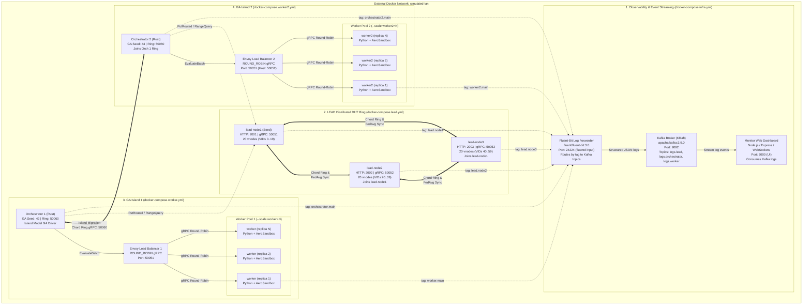

# Docker Compose & Distributed Deployment

This directory contains the multi-container configuration files to run the distributed system in an isolated multi-island simulated LAN network.

## System Architecture Diagram



## Compose Services Breakdown

### 1. Infrastructure (`docker-compose.infra.yml`)
- **`kafka`**: Apache Kafka 3.9.0 running in KRaft mode (no Zookeeper). Exposes port `9092` on the internal network and host.
- **`fluent-bit`**: Fluent-Bit 3.0 configured with dual-output ingestion: tails structured JSON log files from the shared volume `app-logs` (`/var/log/app/*.log`) and listens on port `24224` (Docker forward fallback). Routes logs by tag to Kafka topics:
  - `lead.*` $\to$ `logs.lead`
  - `orchestrator.*` $\to$ `logs.orchestrator`
  - `worker.*` $\to$ `logs.worker`
  - `surrogate.*` $\to$ `logs.surrogate`
- **`monitor`**: Node/Express dashboard on port `3000` consuming Kafka topics in real time, serving the live GA candidate metrics, log console, and interactive Three.js 3D plane geometry viewer.

### 2. LEAD DHT Cluster (`docker-compose.lead.yml`)
- 3 peer containers (`lead-node1`, `lead-node2`, `lead-node3`), each hosting 100 virtual nodes (300 vnodes total on the ring) with durable Sled storage.
- Node 1 serves as the bootstrap node (`SELF_URI=http://lead-node1:50051`); Nodes 2 and 3 join via `JOIN_URI=http://lead-node1:50051`.
- Exposes HTTP debugging endpoints on ports `2001`, `2002`, and `2003`.

### 3. GA Island 1 (`docker-compose.worker.yml`)
- **`orchestrator`**: GA driver initialized with `GA_SEED=42`. Binds ring membership at `0.0.0.0:50060`.
- **`surrogate-node`**: Aerodynamic MLP surrogate microservice running on port `50054` for Tier 2 evaluation and active online retraining.
- **`load-balancer`**: Envoy proxy balancing evaluation requests across all `worker` container replicas using DNS service discovery (`STRICT_DNS`).
- **`worker`**: Python gRPC evaluation service with AeroSandbox aerodynamics, powertrain modeling, and mission simulation. Scaled using `--scale worker=N`.

### 4. GA Island 2 (`docker-compose.worker2.yml`)
- **`orchestrator2`**: GA driver with `GA_SEED=43`. Joins Island 1's ring via `RING_BOOTSTRAP=http://orchestrator:50060` and exchanges migrants every 5 generations.
- **`load-balancer2`**: Envoy proxy (mapped to host port `50052` to avoid collision).
- **`worker2`**: Second independent pool of Python evaluation workers.

---

## How to Run

```bash
# 1. Create shared network and shared log volume
docker network create simulated-lan
docker volume create app-logs

# 2. Start infra (wait for Kafka healthcheck)
docker compose -f compose/docker-compose.infra.yml up -d --build

# 3. Start LEAD DHT cluster
docker compose -f compose/docker-compose.lead.yml up -d --build

# 4. Start GA Island 1 and Island 2 with scaled workers
docker compose -f compose/docker-compose.worker.yml up -d --build --scale worker=4
docker compose -f compose/docker-compose.worker2.yml up -d --build --scale worker2=4
```

## How to Stop

```bash
docker compose \
  -f compose/docker-compose.infra.yml \
  -f compose/docker-compose.lead.yml \
  -f compose/docker-compose.worker.yml \
  -f compose/docker-compose.worker2.yml \
  down -v --remove-orphans
```
